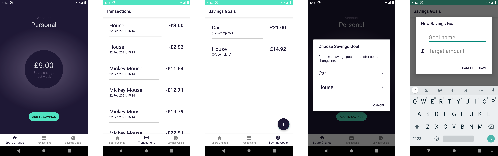

# Spare Change

### Tech Stack

Kotlin, MVVM, Android Architecture Components (LiveData, ViewModel, Data Binding), Koin (dependency injection), Retrofit (networking), RxAndroid, Espresso + jUnit (testing) 

### API Key

Note that you need a valid API key for this project. Visit [this link](https://developer.starlingbank.com/sandbox) to create a new sandbox account and obtain your access token. Once you get your token, replace the string in `api_constants.xml` and you should be good to go!  
